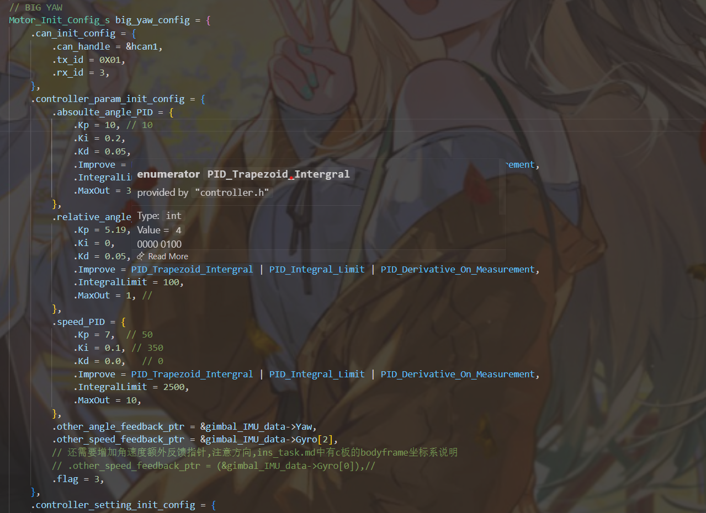
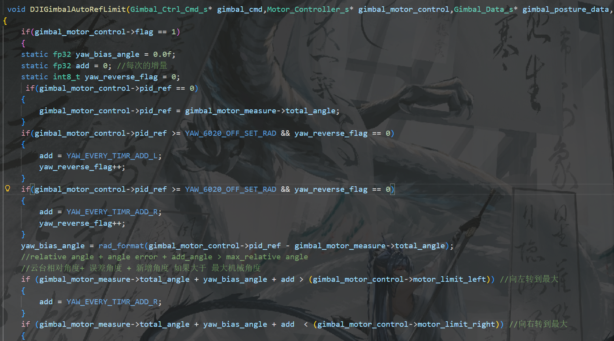
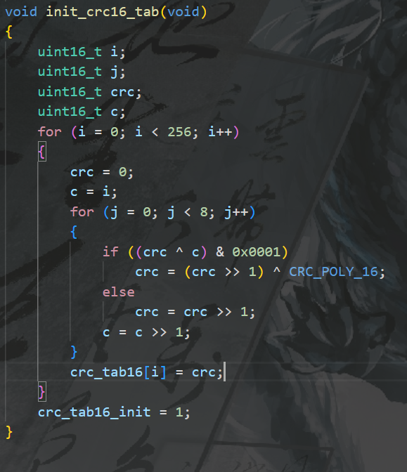
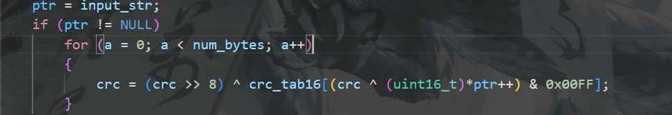
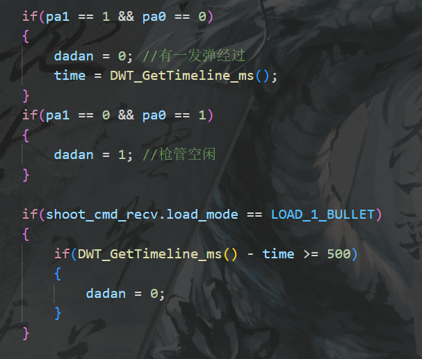
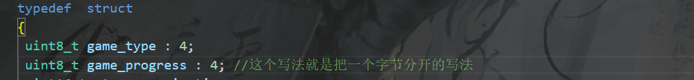

# 经验

## cmd层

对于不用的电机建议直接给无力，不然的话容易进一些奇怪的任务，出现奇怪的问题。（比如把没调过的pitch电机使能了之后就卡在了radformat里面了，这很重要）

## 大yaw

==虽然减速比更改了，但还是会存在误差，大概一圈14的样子，可以在之后考虑给一个补偿==

现在的大yaw转一圈固定6.25，但是每次得到的编码值都不一样，存在很大问题，想办法解决

can总线上如果只有达妙电机的话会出现未知的堵塞现象，其实时硬件问题

之后会对error使用卡尔曼滤波，并且对output输出反值，对比对error限幅机制，和直接对output使用限幅分析好坏

第一版大yawpid:

## 底盘

底盘的问题有可能是轮子打滑。也有可能是因为功率限制，计划先排除并优化功率限制的影响，在着手考虑机械

出现明显的断续感，原因之一是任务的频率，原因之二是kd，导致提前急停

底盘抖动的本质原因还是因为4310的反馈过于抽象了，之后拆车需要重新精校

## 通讯

flag_rersgiter是专门用来判断状态的

不同文件中改变一个变量总共两种方法

静态：

两个文件里设置好静态变量，通过函数的调用来通过一个函数里面的静态变量值改变另外一个静态变量

其他：

也可以通过输入一个数据的指针把一个文件里的变量放到另一个文件里面去改变

可能之后需要检查数据长度是否正确

## 烧录

串口等线如果可以不用C板供电，可以用其他供电的就不要用C板供电，防止大电流反向击穿C板

新C板的串口1有问题

## 参数

拨弹盘2006的绝对角度pid可以给大点，但速度环最多就给35了，甚至更小

deadband本质上来讲是对一些容易飘的东西，比如4310的pos反馈值，陀螺仪的yaw啥的，飘到一定数值后给他复位

这个东西影响pid调试的唯一方面就是可能算到一定程度后不能进一步精进，而且会有虚位

建议对一些不能有太大虚位的东西，如小yaw，大yaw和pitch一定要给0，其他的如anglepid，这个给个0.1差不多

## 低通滤波

dm_init

 LowPassFilter_Init_ByFreq(&motor->measure.position_filter, 1000.0f, 30.0f);

  // 初始化速度低通滤波器 (截止频率50Hz，速度变化更快，滤波稍弱)

  LowPassFilter_Init_ByFreq(&motor->measure.velocity_filter, 1000.0f, 50.0f);

dmdecode

tmp = (uint16_t)((rxbuff[3] << 4) | rxbuff[4] >> 4);

  float raw_velocity = uint_to_float(tmp, DM_V_MIN, DM_V_MAX, 12);

  // 低通滤波平滑速度数据

  measure->velocity = LowPassFilter_Update(&measure->velocity_filter, raw_velocity);

## 反馈数据

一定要记得类型转换，而且一定要对数据进行低通滤波

## 代码习惯问题

||不要写成&&，尤其是在限幅函数里面

## 中心版

左右两边是对成称的

下面的can1口的high,low顺序和丝印相反

C620电调左l右h

大疆中心版左l右h

线序注意的三个点：

1.can线方向相同时观察左右线是否对称或同序

2.中间high，low是否改变了

3.最终解释权由丝印所有

4.或者在头上把线拔掉之后再反插

## USB虚拟串口

usb有发送中断和接收中断两种中断

接受中断会先触发CDC_Receive_FS,然后触发对应回调函数

发送中断会触发USBD_CDC_DataIn函数,然后再触发CDC_TransmitCplt_FS,接着调用我们自己写的回调函数

## CRC16

这个表初始化完成之后得到的就是从1-256一个字节内的所有可能的数据得到的crc校验的可能的结果，中间的if和else就是crc校验的具体算法，crc值一开始默认为0，每次校验都要校验一个字节之内的数据，每一位都要校验所以要校验8次，c = c>>1保证每一位都得到校验

反转多项式即0xA001用于低位优先

它的原体0x8005用于高位优先

初始项0xFFFF是为了确保第一个字节也能被校验到都能够被校验到，

在填入寄存器时，之前是低位优先，那么填入时就把低位填到头一个字节，高位优先就把高位填到头一个字节

这张图片的算法是相邻字节得到的crc值之间的叠加算法

crc = (crc >> 8) ^ crc_tab16[(crc ^ byte) & 0xFF];//低字节优先

crc = (crc << 8) ^ crc_tab16[((crc >> 8) ^ byte) & 0xFF];//高字节优先

LSB和MSB在这里也不一样

## 微动开关

标明5V和GND的引脚哪怕可以改引脚也不能给他接一块

引出来的引脚不一定没用，其实大部分已经用了，出了那8根

当前用PF0，PF1当CN,CO

PA6当COM

## 单发限位

1.微动开动关的逻辑在shoot.c里面和robotcmd里面要翻一下，这是由于枪管内部决定的

2.如果想要单发限位更加灵敏，可以把角度环的最大值给大，把角度环kp给大，把轮空判定的时间给小

轮空判定：

## 报错起因

can mailbox full以及can bus 的原因：

一条can线只有三个硬件邮箱，而这份代码里面在一个控制周期内包含四个帧，因此引发了邮箱不够用的问题，虽然迟滞的信息随后会发出去，但是会存在日志系统的报错

解决方案1：代码层面等待邮箱空闲

解决方案2：代码层面降低摩擦轮电机的发送频率

解决方案3：疑似有问题，把大妙陀螺仪的等待时间改成1

## dmimu

重新上电需要整车重新上电

不然的话其实这个东西就没有下过电，这点很重要

## markdown使用经验

图片名字带中文好像会导致找不到图片，建议不要插入图片后去选图片，直接ctrl+c再ctrl+v即可

### 新了解到的语法

想要在定义结构体是就把一个字节分开可以这么写

字节的8位 (从右到左，bit 0 到 bit 7):
┌───┬───┬───┬───┬───┬───┬───┬───┐
│ 7 │ 6 │ 5 │ 4 │ 3 │ 2 │ 1 │ 0 │ ← 位编号
├───┴───┴───┴───┼───┴───┴───┴───┤
│game_progress  │  game_type    │
│   0 1 0 1     │  0 0 1 1      │
└───────────────┴───────────────┘
        5               3

==实际字节值: 0x53 (二进制: 01010011)==

==越靠前位数越高，数字越大位数越高==
